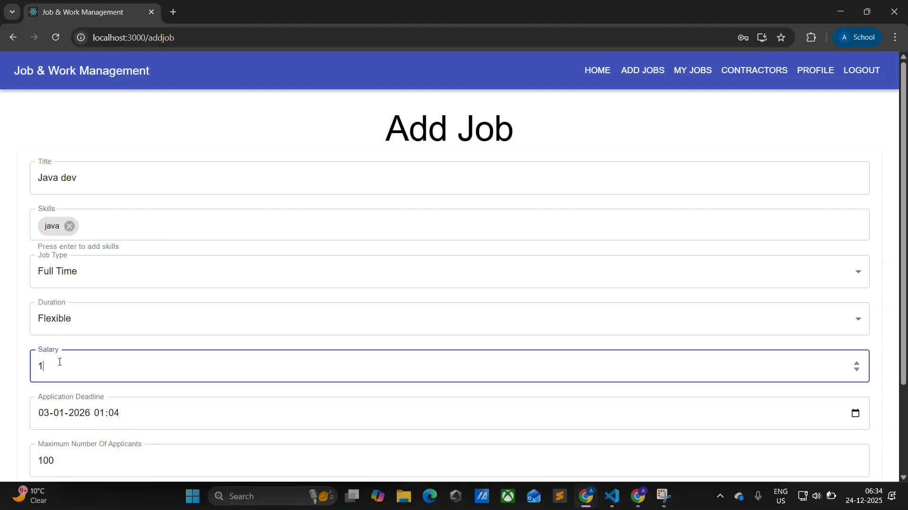
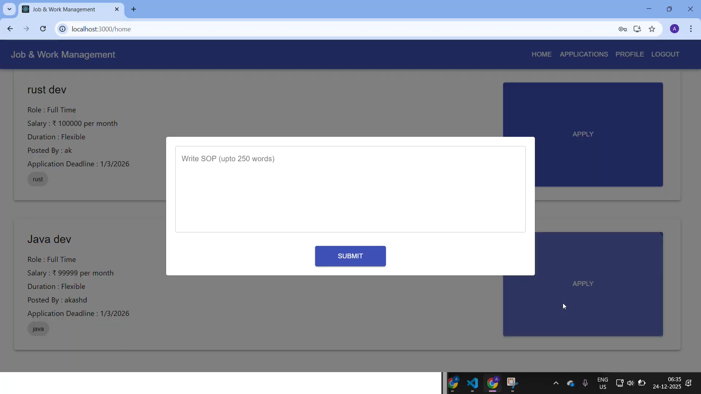

# Contractor Job & Work Order Management Module

A comprehensive MERN Stack web application designed to streamline the workflow between Agents and Contractors. This system facilitates job allocation, work order approval, and tracking from assignment to invoicing.

## 📹 Project Demo
**[Click here to watch the project walkthrough and demo](https://drive.google.com/file/d/1ewk_vmNCI5aROQ1FrlHblGHJuZSSqpWU/view)**

---

## 🛠 Tech Stack

**Frontend:**
* React.js
* Redux & Thunk
* Material-UI (Core, Icons, Lab)
* Axios

**Backend:**
* Node.js & Express.js
* MongoDB & Mongoose
* JWT (JSON Web Tokens) for Authentication
* Passport.js (Local & JWT strategies)

---
## 📸 Dashboards

### Agent Dashboard

### Contractor Dashboard

---
